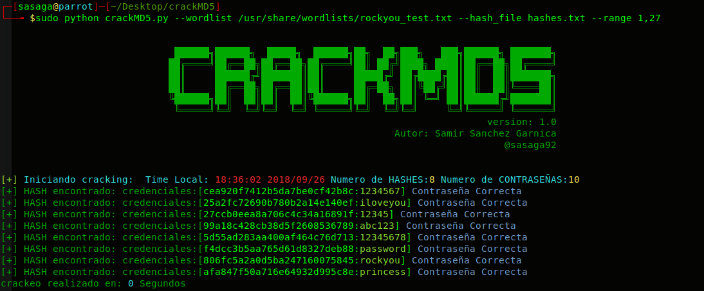

# crackMD5

crackMD5 es un script desarollado en python que permite atacar por fuerza bruta a traves de diccionario un hash MD5 que ha sido modificado a traves de metodos como
substring, supongamos que la palabra ```password``` cifrado en MD5 es ```5f4dcc3b5aa765d61d8327deb882cf99``` aplicando el metodo substring hash.[1:27] nos quedaria como resultado ```f4dcc3b5aa765d61d8327deb88```.


Ejemplo de uso
```
<<<<<<< HEAD
python crackMD5.py --wordlist /usr/share/wordlist/rockyou.txt --hash_file hashes.txt --range 1,27  
=======
python crackMD5.py --wordlist /usr/share/wordlist/rockyou.txt --hash_file hashes.txt --range 1,27 
>>>>>>> 0eade6e8cd54c670c9954b18f1f0bddc20d3f295
```



Puedes colaborar a que siga creando nuevas herramientas con una donación en [Paypal](https://www.paypal.com) al correo ssanchezga@ufpso.edu.co
by [@sasaga92](https://twitter.com/sasaga92)


:heart_eyes: happy hacking!!!
